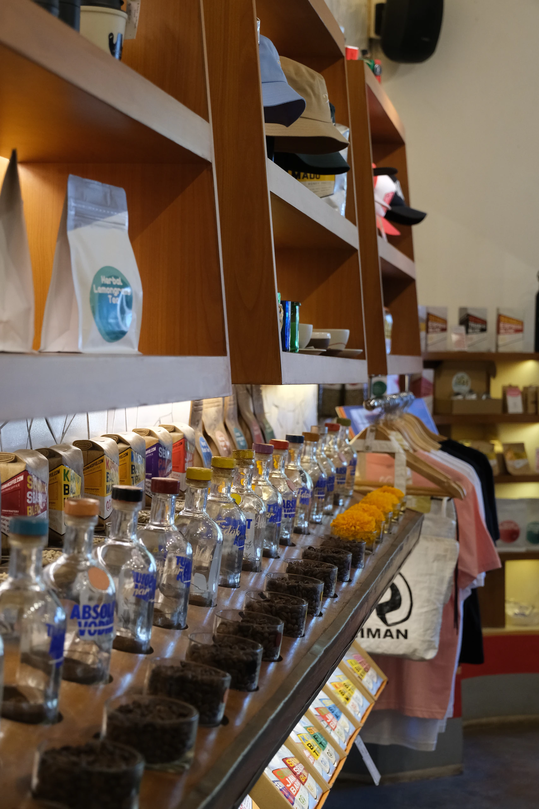

## Seniman Coffee Renon feels like a coffee shop designed by people who genuinely enjoy making things.

What stood out during our visit was not one dramatic feature, but how much character had been worked into the smaller details. The colorful chairs, unusual mugs, retail shelves, ceiling, and even the bathroom entrance all feel considered. There is plenty happening visually, but the space does not come across as staged or overly polished.

The coffee is still the main reason to visit, especially if you enjoy exploring Indonesian beans, but the art space and shop give the place more personality than a straightforward specialty coffee bar. It feels creative, relaxed, and slightly unconventional; the kind of cafe where looking around is part of the experience.

## First Impression

- Artistic
- Playful
- Thoughtful
- Relaxed

## Good For

- Specialty Coffee
- WFC
- Hangout
- Casual Meeting
- Indoor
- Outdoor
- Aesthetic Photo Spot
- Art Lovers

# 2. THE EXPERIENCE

## Every corner has something to look at

Seniman moved into this Tukad Musi spot from the old Toko Seniman shop, and the extra room clearly helped.

The terracotta counter bar sits at the center of the space, with seating arranged around it: the recycled plastic rocking chairs Seniman is known for, wooden tables for anyone who needs a proper surface to work on, and a few seats outside if you want air. Murals, the retail shelves, and a vinyl corner with a turntable fill in the rest, so wherever you end up sitting, there is something to look at.

We came on a weekday and it was busy without being loud. People were reading, working, and catching up in roughly equal numbers, and the music stayed at a volume where you could still hear the person across the table.

This is a place that rewards slowing down. If you are in a rush, you will miss most of what makes it good.

### Ambience

**⭐ 4.6 / 5**

## Work Experience

### WFC Friendly

**⭐ 4.5 / 5**

The room stays calm enough to focus in, and there is a seat for most working styles: the bar, proper tables, the lounge chairs, and the covered area outside. It is not a co-working space, but nobody seems to mind a laptop open for a couple of hours.

### Wi-Fi

**⭐ 4 / 5**

The Wi-Fi handled normal work without complaints, though we did not push it with anything heavy.

### Power Outlets

**Enough**

There are outlets around, but they are not at every seat. Worth picking your table with that in mind if you are staying a while.

## Seating & Space

### Area

**Indoor & Outdoor**

Available seating includes:

- Individual tables
- Sofas
- Bar seating
- Rocking chairs

### Space Size

**Spacious**

There is room to move between the bar, the tables, the lounge chairs, and the covered area at the back, so it rarely feels like you are stuck with whatever seat is left.

## Environment

### Noise Level

**Quiet**

The room stays calm even when most of the seats are taken, and the music never climbs over the conversation at your own table.

### Air Conditioning

**AC**

The indoor area is air-conditioned, and the covered seating at the back is the better option if you would rather have air than cold.

## Food & Beverage Available

- Coffee
- Specialty Coffee
- Non-Coffee
- Tea
- Dessert
- Bakery

## Experience Scores

### WFC Experience

**⭐ 4.7 / 5**

### Service

**⭐ 4.6 / 5**

### Comfort

**⭐ 4.6 / 5**

# 3. GOOD TO KNOW

## Spending

**Rp30K–100K per person**

A single coffee sits at the lower end. Add a pastry or one of the signature drinks and you land nearer the top.

## Parking

### Motorcycle

**Enough**

### Car

**Limited**

On-site parking is tight. A motorbike is easy to place, but arriving by car during the busier hours may leave you looking for space on the street.

## Facilities

- Toilet
- Wi-Fi
- Power Outlet

The toilet is at the back, past the covered outdoor seating.

## Best Time to Visit

**Morning · Early Afternoon**

Doors open at 7:30 and the room stays unhurried through the first half of the day. Evenings are the busiest stretch, so come earlier if you want the quiet version of the place.

## Reservation

**Not Needed**

Walking in is normally fine. Evenings are the exception; if you are coming with a group after dark, booking a table ahead saves you standing around.

# 4. UNIQUENESS

## Almost everything here was made by Seniman

Seniman means artist in Indonesian, and the name works closer to a job description than a brand.

Alongside the coffee, Seniman runs its own product and interior design division. The furniture, the tableware, the lighting, the merchandise, and the interiors themselves are designed in-house. So the unusual mugs and the chairs you noticed on the way in are not sourced decor; they are products, and the cafe doubles as the showroom.

The coffee follows the same logic. Seniman roasts its own beans, and the line-up rotates through Indonesian single origins instead of settling on one house blend, which is why the bar looks slightly different depending on when you turn up.

## The Bar Roker

**The chair you are sitting in is the product**

The rocking chairs are Seniman's best-known design. They start from the cheap injection-molded plastic chair you have seen at every warung in Indonesia, then add a rocker base of reclaimed Balinese teak, cut and finished by hand.

The result is weatherproof, stackable, flat-packed, and far more comfortable than it has any right to be. You can buy one, along with the beans and the glassware, from the retail shelves a few steps from your table.

## Coffee

**⭐ 4.6 / 5**

Because the single-origin selection rotates, it is worth asking what is on the bar that week rather than defaulting to your usual order.

## What Surprised Us

**The bathroom entrance**

Not a sentence we expected to write either. But it is the clearest sign of how far the design thinking goes here: even the part of a cafe nobody bothers with has been given some attention.

## Unique Features

- Signature Menu
- In-House Roastery
- Original Furniture Design
- Art Space
- Retail Shop
- Vinyl Corner

# 5. OUR TAKE

What would bring us back is not one single thing, which is rather the point.

Most cafes show you everything they have in the first thirty seconds. Seniman does not. You notice the chair first, then the mug, then the ceiling, then the shelf behind you, and by the time the second cup arrives you are still finding things. For somewhere you might sit for two hours, that matters more than we expected it to.

It helps that none of it reads as decoration bought in for the photos. The chairs, the tableware, and the room itself came from the same people who roast the coffee, and you can tell.

The practical side holds up too. Doors open at 7:30, the room stays calm through the morning, and the coffee is the same standard Seniman built its name on in Ubud, without the drive to Ubud.

## But...

The density that makes this place interesting is the same thing that could put you off.

If what you want is a plain, quiet box to disappear into for a work session, there is a lot going on here. And parking is the real constraint: a motorbike is no trouble, but arriving by car in the evening is a gamble.

It is also not the cheapest coffee in Denpasar. You are paying for beans Seniman roasts themselves, which we think is fair, but it is worth knowing before you order.

## Who Might Skip This?

- Anyone who needs a silent, minimal workspace
- Car arrivals at peak hours
- Anyone after the cheapest coffee nearby

# 6. THE VERDICT

## Is it worth your time?

If you are anywhere near Denpasar and you have been meaning to visit Seniman in Ubud, come here instead. Same coffee, same thinking, considerably less driving.

Arrive in the morning, take a rocking chair, ask what single origin is on the bar, and give yourself longer than you think you need. This is a place that gets better the more attention you pay it, which is not something we can say about most cafes.

### Experience

**⭐ 4.6 / 5**

### Ambience

**⭐ 4.6 / 5**

### Visual

**⭐ 4.9 / 5**

### Service

**⭐ 4.6 / 5**

### Value for Money

**⭐ 4.6 / 5**

## Would We Come Back?

**Yes**

Especially for a slow morning, a specialty coffee run, or a couple of hours of unhurried work.
