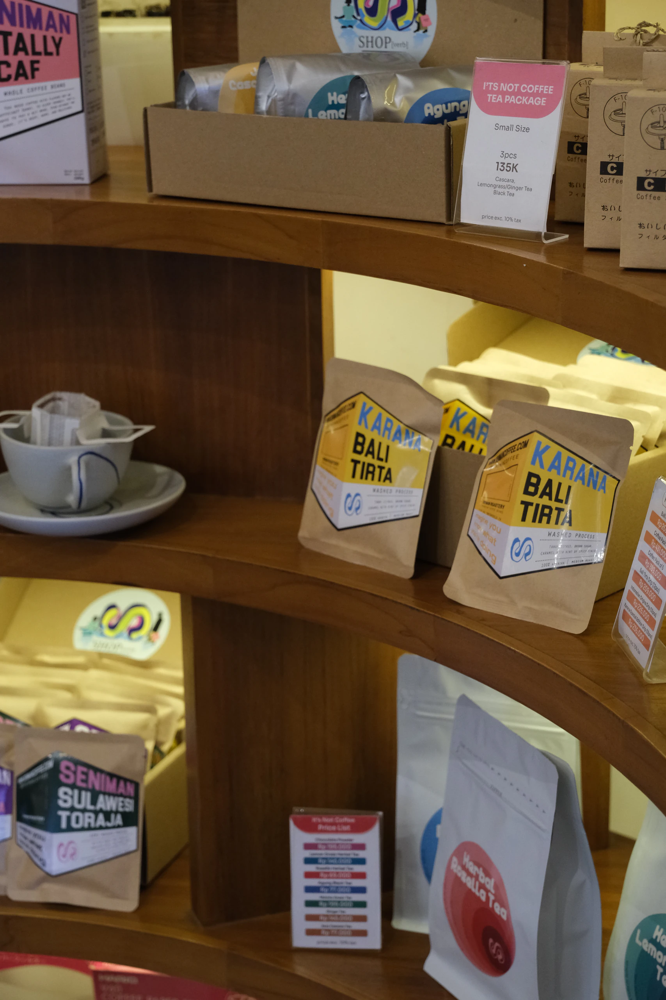
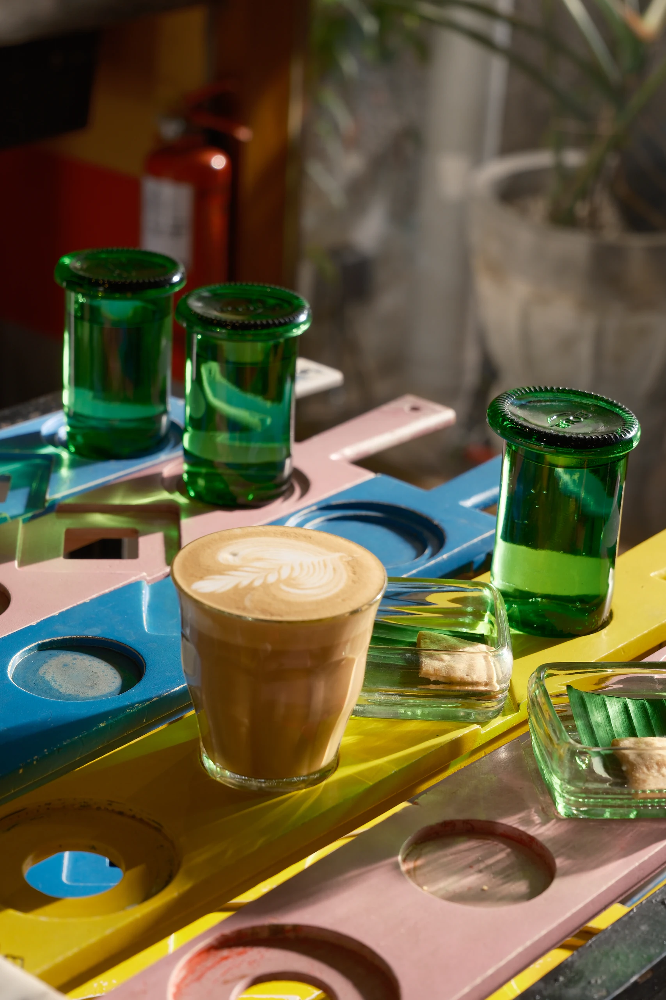

## Seniman Coffee Renon feels like a coffee shop designed by people who genuinely enjoy making things.

What stood out during our visit was not one dramatic feature, but how much character had been worked into the smaller details. The colorful chairs, unusual mugs, retail shelves, ceiling, and even the bathroom entrance all feel considered. There is plenty happening visually, but the space does not come across as staged or overly polished.

The coffee is still the main reason to visit, especially if you enjoy exploring Indonesian beans, but the art space and shop give the place more personality than a straightforward specialty coffee bar. It feels creative, relaxed, and slightly unconventional; the kind of cafe where looking around is part of the experience.

## First Impression

- Artistic
- Playful
- Thoughtful
- Relaxed

## Good For

- Specialty Coffee
- WFC
- Hangout
- Casual Meeting
- Indoor
- Outdoor
- Aesthetic Photo Spot
- Art Lovers

# 2. THE EXPERIENCE

## Every corner has something to look at

Seniman moved into this Tukad Musi spot from the old Toko Seniman shop, and the extra room clearly helped.

The terracotta counter bar sits at the center of the space, with seating arranged around it: the recycled plastic rocking chairs Seniman is known for, wooden tables for anyone who needs a proper surface to work on, and a few seats outside if you want air. Murals, the retail shelves, and a vinyl corner with a turntable fill in the rest, so wherever you end up sitting, there is something to look at.

We came on a weekday and it was busy without being loud. People were reading, working, and catching up in roughly equal numbers, and the music stayed at a volume where you could still hear the person across the table.

This is a place that rewards slowing down. If you are in a rush, you will miss most of what makes it good.

### Ambience

**⭐ 4.8 / 5**

## Work Experience

### WFC Friendly

**⭐ 4.5 / 5**

The room stays calm enough to focus in, and there is a seat for most working styles: the bar, proper tables, the lounge chairs, and the covered area outside. It is not a co-working space, but nobody seems to mind a laptop open for a couple of hours.

### Wi-Fi

**⭐ 4 / 5**

The Wi-Fi handled normal work without complaints, though we did not push it with anything heavy.

### Power Outlets

**Enough**

There are outlets around, but they are not at every seat. Worth picking your table with that in mind if you are staying a while.

## Seating & Space

### Area

**Indoor & Outdoor**

Available seating includes:

- Individual tables
- Sofas
- Bar seating
- Rocking chairs

### Space Size

**Spacious**

There is room to move between the bar, the tables, the lounge chairs, and the covered area at the back, so it rarely feels like you are stuck with whatever seat is left.

## Environment

### Noise Level

**Quiet**

The room stays calm even when most of the seats are taken, and the music never climbs over the conversation at your own table.

### Air Conditioning

**AC**

The indoor area is air-conditioned, and the covered seating at the back is the better option if you would rather have air than cold.

## Food & Beverage Available

- Coffee
- Specialty Coffee
- Non-Coffee
- Tea
- Dessert
- Bakery

## Experience Scores

### WFC Experience

**⭐ 4.7 / 5**

### Service

**⭐ 4.8 / 5**

### Comfort

**⭐ 4.8 / 5**
