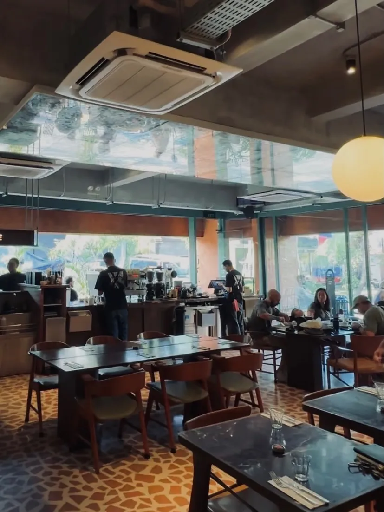
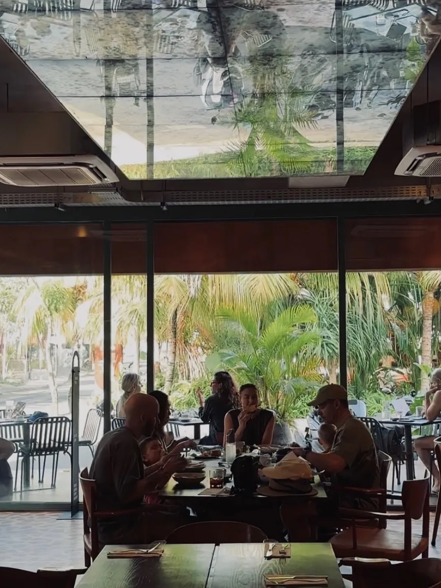
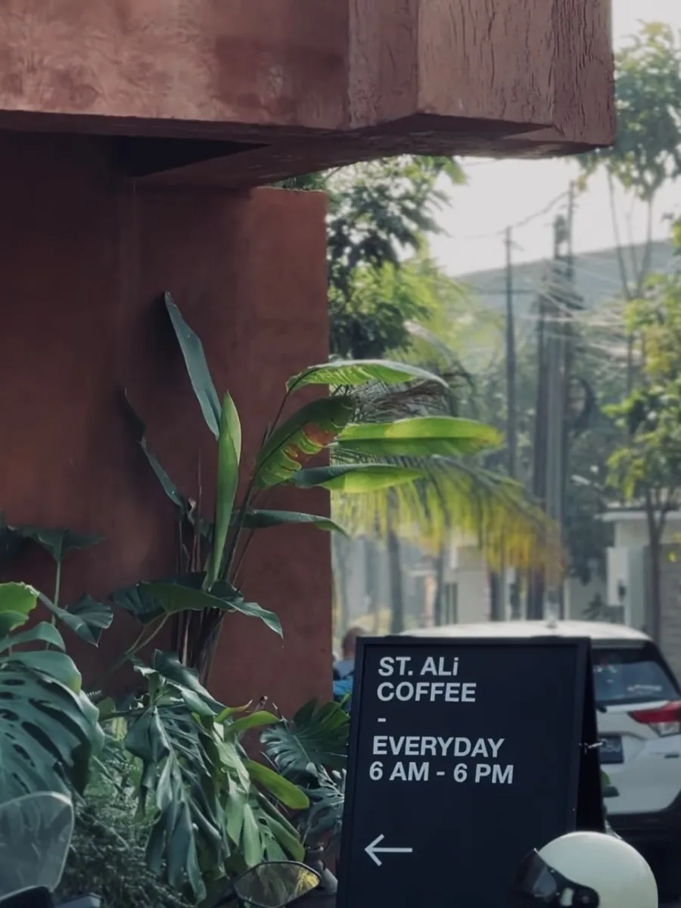
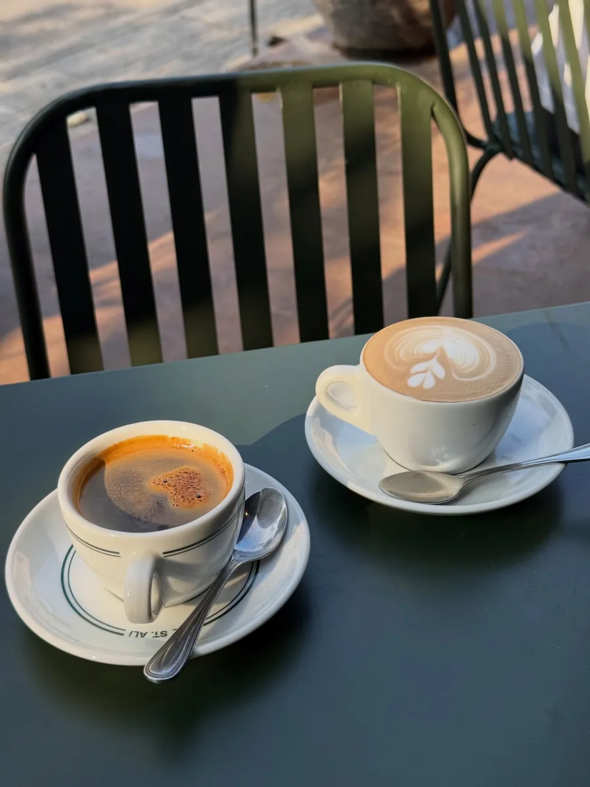
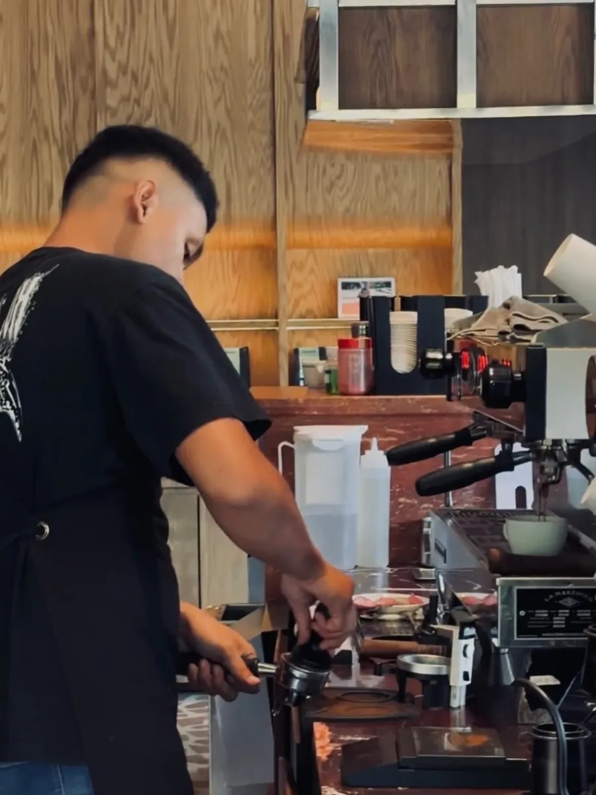
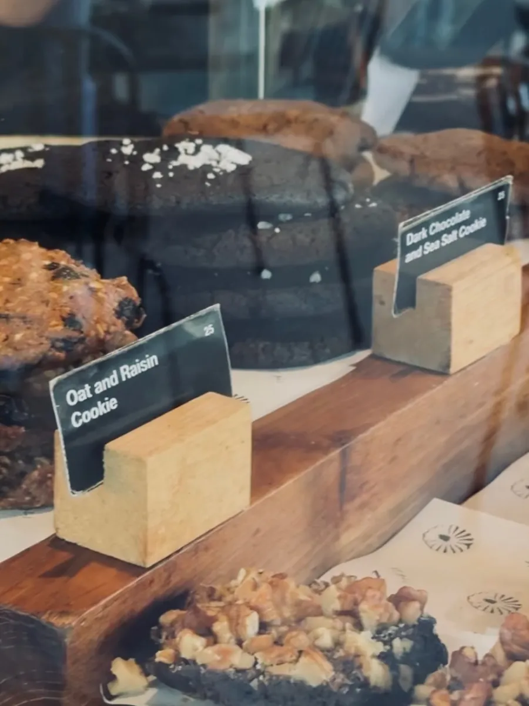

## ST. ALi Bali is a morning spot that feels made for slow starts.

It is a spacious, cozy cafe in Pererenan with a semi-indoor, semi-outdoor setup. When we visited in the morning, the whole place felt chill; perfect for grabbing coffee, having breakfast, and watching the street slowly come alive.

The location sits right on the corner of the road, so the building has a real presence without losing that comfortable, relaxed feel.

## First Impression

- Spacious
- Cozy
- Authentic
- Quiet

## Good For

- Morning Coffee
- Breakfast
- WFC
- Hangout
- Indoor
- Outdoor
- Aesthetic Photo Spot
- Me-Time
- Casual Date

# 2. THE EXPERIENCE

## Best enjoyed in the morning

We came here in the morning, and that felt like the right time to experience the place.

The outdoor seating gives you a view of the street, so you can enjoy coffee and breakfast while watching people go about their day. The mixed indoor-outdoor setup also gives you a choice depending on how you want to spend your time.

For WFC, the place gets a solid score, although we have not personally done a full work session here yet. Wi-Fi speed was not checked during our visit, and power outlets are limited.

There are individual tables, communal tables, and sofas, with a generally quiet atmosphere when we visited.

### Ambience

**⭐ 4.8 / 5**

## Work Experience

### WFC Friendly

**⭐ 4 / 5**

Comfortable enough for a short session, especially at an indoor table, but not the main reason we would come here. Limited outlets make a longer laptop stretch slightly inconvenient, particularly outside.

### Wi-Fi

**Not Checked**

We did not test Wi-Fi speed during this visit.

### Power Outlets

**Limited**

Outlets exist, but they are not plentiful. Worth claiming a seat near one if you plan to stay plugged in.

## Seating & Space

### Area

**Indoor & Outdoor**

Available seating includes:

- Individual tables
- Communal tables
- Sofas

### Space Size

**Spacious**

There is room to move between the bar, the dining tables, and the outdoor benches, so it rarely feels cramped.

## Environment

### Noise Level

**Quiet**

In the morning it stayed calm enough for conversation or a low-key hangout without needing to raise your voice.

### Air Conditioning

**Fan / Open Air**

The indoor side is sheltered, while the outdoor seating leans into the open Pererenan air. Pick based on how warm the day feels.

## Food & Beverage Available

- Coffee
- Specialty Coffee
- Non-Coffee
- Breakfast
- Brunch
- Light Meals
- Bakery
- All-Day Dining

## Experience Scores

### Coffee / Beverage

**⭐ 4.8 / 5**

### Food

**⭐ 4.7 / 5**

### WFC Experience

**⭐ 4.5 / 5**

### Service

**⭐ 4.3 / 5**

### Comfort

**⭐ 4.4 / 5**

# 3. GOOD TO KNOW

## Spending

**Rp30K–100K per person**

A coffee sits toward the lower end. Add breakfast or a longer hangout and you move nearer the top. Prices lean a little premium, which is fairly standard for Pererenan.

## Parking

### Motorcycle

**Limited**

### Car

**No Dedicated Parking**

Street parking is the reality here. Arrive by scooter if you can; a car means hunting for space nearby.

## Facilities

- Toilet
- Smoking Area
- Wi-Fi
- Power Outlet

## Best Time to Visit

**Morning · Afternoon**

Doors open at 06.00 and the place closes at **18.00**, so this is not an evening hangout that runs into the night. Morning through early afternoon is when it feels most like itself.

## Reservation

**Not Needed**

Walking in is normally fine.

# 4. UNIQUENESS

## The outdoor seating is the star of the morning

One of the details we really liked was how the outdoor seating is positioned. The benches almost feel placed for enjoying the morning sun while taking in the Pererenan street atmosphere.

The corner location and building design also make the cafe quite photogenic, so there are plenty of little angles worth capturing.

And with a pretty wide selection of food and drinks, there is enough variety whether you are stopping by for coffee and breakfast or staying for a longer hangout.

## Coffee

**⭐ 4.8 / 5**

The coffee is a clear reason to visit. House blend, espresso, cold brew, and longer barista sets sit on the menu, and what we ordered held up well.

## Food

**⭐ 4.7 / 5**

Breakfast and bakery options make it easy to turn a coffee stop into a proper morning meal.

## Unique Features

- Corner Street Presence
- Outdoor Morning Seating
- Retail Corner
- Photogenic Facade
- Wide Food & Drink Menu

# 5. OUR TAKE

ST. ALi feels like one of those places that works best when you **do not have to rush**.

Come in the morning, grab a coffee, order some breakfast, sit outside, and just watch Pererenan wake up. That is probably the experience we enjoyed most here.

It is also a nice option for a casual hangout or some me-time. The space is comfortable and visually interesting without feeling overly designed.

## But...

For WFC, we would say it is **good but not necessarily the main reason we would come here**. Limited outlets can make a longer laptop session slightly inconvenient, especially if you are sitting outside.

The other consideration is the price. Food and drinks are a little on the pricier side, although that may be fairly standard for the Pererenan area.

And if you are coming without private transport, parking could be another consideration.

Our take is based on our visit on 2 August 2026.

## Who Might Skip This?

- Anyone after a dedicated WFC setup with plentiful outlets
- Budget-first cafe runs
- Evening hangouts that need to go past 18.00

# 6. THE VERDICT

## Is it worth your time?

If you are around Pererenan and looking for a nice short stop for coffee, breakfast, and enjoying the street atmosphere, ST. ALi is definitely worth checking out; especially in the morning.

### Experience

**⭐ 4.6 / 5**

### Ambience

**⭐ 4.8 / 5**

### Visual

**⭐ 4.9 / 5**

### Service

**⭐ 4.4 / 5**

### Value for Money

**⭐ 4.5 / 5**

## Would We Come Back?

**Yes**

Especially for a relaxed morning coffee, breakfast outside, or a casual me-time stop.

**Go here if:** you want a relaxed morning coffee or breakfast with a nice outdoor atmosphere.

**Maybe skip if:** you are specifically looking for a budget-friendly cafe, a dedicated WFC spot, or somewhere to hang out until late.
