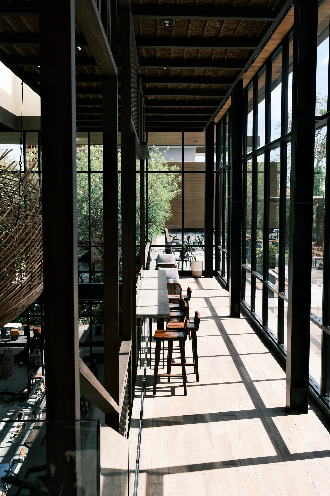
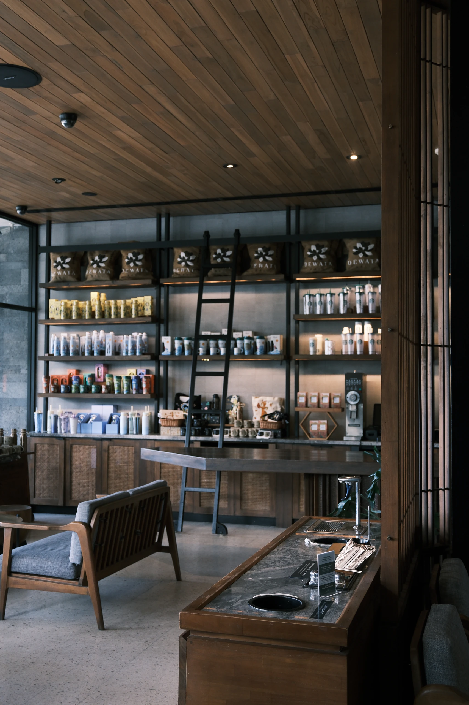
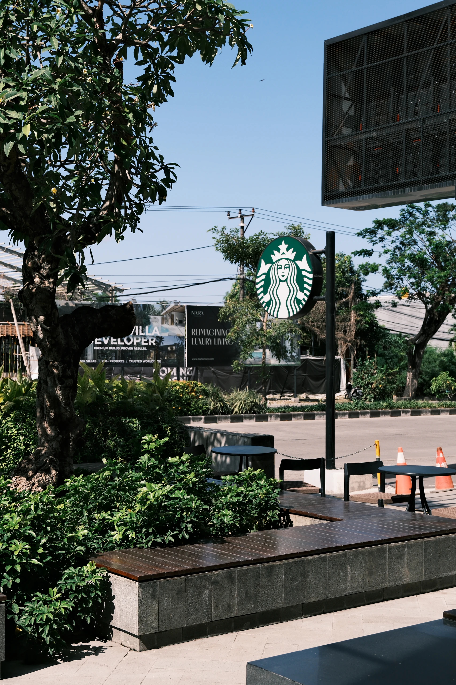

Starbucks Dewata is one of those places that feels easy to spend time in.

The space is **spacious, modern, and slightly luxurious**, but it does not feel too formal. When we visited on a weekday afternoon, the atmosphere was surprisingly quiet, making it easy to settle in whether you are coming alone or with other people.

## First Impression

- Spacious
- Modern
- Luxurious
- Quiet

## Good For

- WFC
- Hangout
- Meeting
- Indoor
- Outdoor
- Family Friendly
- Aesthetic Photo Spot

# 2. THE EXPERIENCE

## A space you can actually stay in

The first thing we noticed was how big the place is.

There are plenty of seating options, from individual tables and communal tables to sofas and bar seating. You can choose between indoor and outdoor areas depending on what kind of mood you're in.

We visited after lunch on a weekday, and at that time, it was relatively quiet. Working alone felt comfortable, but the space also works well if you're coming with friends or having a casual meeting.

### Ambience

**⭐ 4.5 / 5**

## Work Experience

### WFC Friendly

**⭐ 5 / 5**

Starbucks Dewata is genuinely comfortable for working. The space is large enough to spend a few hours without feeling like you're taking up someone's table.

### Wi-Fi

**⭐ 4 / 5**

The Wi-Fi was fast during our visit, although we occasionally had to reconnect.

### Power Outlets

**Enough**

There are enough outlets around the space, but not every table has one. If you're planning to stay for a long time, it might be worth looking around before choosing your seat.

## Seating & Space

### Area

**Indoor & Outdoor**

Available seating includes:

- Individual tables
- Communal tables
- Sofas
- Bar seating

### Space Size

**Spacious**

The layout gives you enough options to choose a spot depending on whether you're working, meeting someone, or simply hanging out.

## Environment

### Noise Level

**Quiet**

Based on our weekday afternoon visit, the space was calm enough to work or spend time alone comfortably.

### Air Conditioning

**AC**

The indoor area is air-conditioned. Just a small note from our experience: the second floor can get quite cold later in the day, so bringing a light jacket wouldn't be a bad idea.

Some spots upstairs can also get direct sunlight in the afternoon, although the large windows give the space plenty of natural light and views.

## Food & Beverage Available

- Coffee
- Specialty Coffee
- Non-Coffee
- Breakfast
- Light Meals
- Dessert
- Bakery
- International Food

## Experience Scores

### WFC Experience

**⭐ 4.7 / 5**

### Service

**⭐ 4.4 / 5**

### Comfort

**⭐ 4.5 / 5**

# 3. GOOD TO KNOW

## Spending

**Rp30K–75K per person**

This depends on what you order, but the price range feels reasonable for the overall experience and facilities available.

## Parking

### Motorcycle

**Plenty**

### Car

**Plenty**

Parking is available in a dedicated area and was spacious enough during our visit. One less thing to worry about if you're planning to stay for a while.

## Facilities

- Toilet
- Wi-Fi
- Power Outlet

## Best Time to Visit

**Weekday Afternoon**

We came after lunch on a weekday and had no trouble finding a seat. If you want the upstairs without the glare, aim earlier rather than later in the afternoon.

## Reservation

**Not Needed**

You can simply walk in. For solo visitors or small groups, finding a spot should generally be easier, especially when the place isn't too busy.

## Accessibility

- Wheelchair Accessible
- Accessible Toilet

There is also a lift, which makes moving between floors easier for elderly visitors or anyone with mobility needs.

# 4. UNIQUENESS

## More than a regular Starbucks run

What separates Starbucks Dewata from a normal outlet is the **Starbucks Reserve** side of it.

There's a dedicated Reserve bar with a different setup from the usual counter, plus a menu of drinks you won't find at your neighborhood Starbucks.

One thing caught our attention straight away.

## The Oviso

**Only one in Indonesia**

The Oviso is Starbucks' own espresso machine, built for Reserve stores, and Dewata is the only place in Indonesia you can see one.

It works the opposite way to a normal machine: instead of the shot falling into the cup, water is pushed upward and the espresso fills a glass cylinder from the bottom. The milk gets steamed the same way.

It looks nothing like a regular espresso machine, but more than that, the whole setup turns ordering and watching your drink get made into part of the visit.

Honestly, it left us curious enough to come back and work through more of the Reserve menu.

## Coffee

**⭐ 4.5 / 5**

Our rating covers only what we actually ordered:

- Americano
- Aerocano

The Aerocano was the one that stood out. The presentation is genuinely interesting, and the coffee still has the consistency you'd expect from Starbucks.

## Unique Features

- Signature Menu
- Garden
- Unique Space Concept
- Coffee Class
- Special Facilities

# 5. OUR TAKE

What would bring us back isn't the Wi-Fi or the number of seats.

It's the **overall vibe**.

Starbucks Dewata feels modern and premium, but at the same time surprisingly chill. You can come here to work, take a meeting, hang out with friends, or simply spend a few hours alone with a book or your laptop.

And when you've been sitting inside too long, the outdoor area gives you a change of scenery.

## But here's the thing

If you're looking for a small, intimate cafe with a more personal specialty coffee experience, this probably isn't the place.

At the end of the day, **it still feels like Starbucks.** Just with a much bigger space, a more complete setup, and a few experiences you won't find at every outlet.

Our take is subjective, and based on one weekday afternoon visit.

# 6. THE VERDICT

## Is it worth your time?

### Experience

**⭐ 4 / 5**

### Ambience

**⭐ 4.7 / 5**

### Visual

**⭐ 4.6 / 5**

### Service

**⭐ 4.5 / 5**

### Value for Money

**⭐ 4.5 / 5**

## Would We Come Back?

**Yes**

Especially for a work session, a meeting, or a casual hangout.
