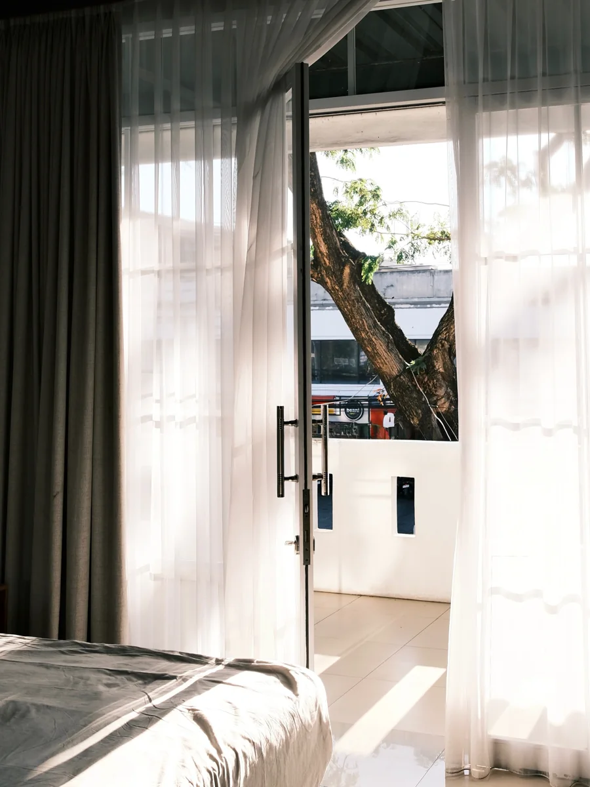
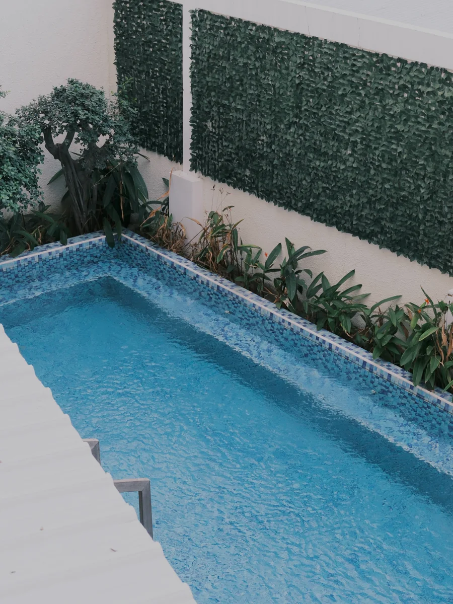
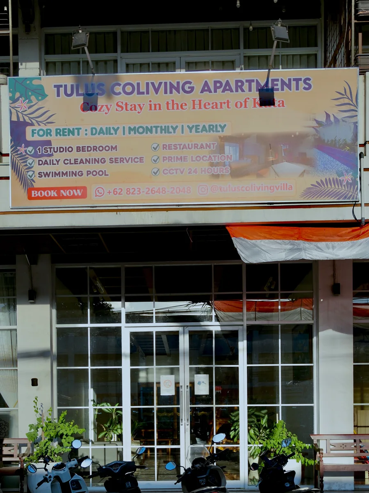

## Tulus Coliving is a cozy, modern apartment stay that makes Kuta feel easy.

It is a spacious apartment-style place with a minimal setup: quiet enough to rest, close enough to beaches, cafes, and everyday stops that you do not have to plan every outing.

The first impression is of a complete room rather than a stripped-back hostel bed. Wardrobe, TV, indoor kitchen, private bathroom, and sunlight through the curtains all show up before you even think about leaving.

## First Impression

- Spacious
- Cozy
- Minimal
- Modern
- Quiet

## Good For

- Longer Stay
- Digital Nomad
- Couple
- Convenient Location
- Near Beach
- Apartment Stay

# 2. THE EXPERIENCE

## A complete apartment setup for an easy Bali stay

The unit feels comfortable and well equipped. The room is medium-sized, the bed scored well, cleanliness held up, and privacy is stronger than a dorm because you get your own space.

Inside the room you get a large wardrobe, a full TV setup, an indoor kitchen with cooking equipment and a sink, and a private bathroom. Shared areas add a balcony, swimming pool, common room, and private parking. Free drinking-water refills are available from the dispenser.

### Ambience

**⭐ 4.7 / 5**

## Stay Experience

### Bed Comfort

**⭐ 4.8 / 5**

The bed was comfortable enough that sleep was not the thing we thought about during the stay.

### Cleanliness

**⭐ 4.8 / 5**

The room and bathroom stayed in good shape for an apartment-style setup.

### Privacy

**⭐ 4.7 / 5**

You get a private apartment unit, not a shared dorm. That is the main upgrade over a hostel stay in the same area.

### Check-in & Service

**⭐ 4.7 / 5**

Check-in went smoothly. Service sat at **4.6 / 5**. One practical note: contacting the property manager usually means chatting first, though most day-to-day needs are already covered inside the apartment.

## Rooms & Space

### Room Type

**Apartment**

### Room Size

**Medium**

Spaces around the property include:

- Private apartment room
- Indoor kitchen
- Private bathroom
- Shared balcony
- Swimming pool
- Common room
- Private parking

## Environment

### Noise Level

**Quiet**

The unit feels calm relative to how busy Kuta is outside.

### Air Conditioning

**AC**

The room is air-conditioned. The balcony and pool areas are open-air.

## Facilities On Site

- Swimming Pool
- Common Room
- Private Parking
- Indoor Kitchen
- Free Drinking Water
- Wi-Fi
- Toilet
- Smoking Area

## Experience Scores

### Stay Experience

**⭐ 4.7 / 5**

### Service

**⭐ 4.6 / 5**

### Comfort

**⭐ 4.7 / 5**

# 3. GOOD TO KNOW

## Spending

**Under Rp500K per night**

For a complete apartment setup in Kuta, the price lands in a practical range rather than a boutique one.

## Parking

### Motorcycle

**Plenty**

### Car

**Plenty**

Private parking is available, which is a real advantage on Jl. Raya Kuta.

## Facilities

- Toilet
- Smoking Area
- Free Drinking Water
- Wi-Fi
- Swimming Pool
- Common Room
- Private Parking

## Best Time to Visit

**Anytime for a stay base**

This works as a longer stay more than a one-hour stop. Beach access is around **5 minutes by motorbike**, with cafes and minimarkets nearby.

## Reservation

**Not Needed**

Walking in / arranging directly was fine for our visit, though chatting the manager first is how contact usually works.

# 4. UNIQUENESS

## It feels more complete than you expect from the price

The indoor kitchen, cooking equipment, large wardrobe, TV, bathroom, and free drinking-water refill mean you are not constantly leaving for basics.

Location is the other plus. Beach proximity plus nearby cafes and minimarkets keeps daily life simple.

## What's Unique Here

**Apartment completeness at a stay-friendly price**

You get more than a bed: a kitchen you can cook in, storage that actually fits a longer stay, and shared amenities without giving up a private room.

## Unique Features

- Indoor Kitchen
- Large Wardrobe
- Private Bathroom
- Swimming Pool
- Common Room
- Near Beach
- Private Parking

# 5. OUR TAKE

Tulus Coliving is the kind of place that makes a Bali stay feel pretty easy.

The room is comfortable and comes with most of what we want for a longer stay, especially the kitchen setup, wardrobe, TV, and easy drinking-water refills.

We also liked the location. Around **5 minutes from the beach by motorbike**, with cafes and minimarkets nearby, means you do not have to travel far for food, coffee, or everyday needs.

## But...

The small inconvenience is that reaching the property manager generally means chatting first. It was not a major issue during our stay because most facilities were already available in the apartment, but it is worth knowing if you prefer front-desk staff on call.

Our take is based on our visit on 27 August 2026.

## Who Might Skip This?

- Anyone who wants dedicated on-site staff available without messaging first
- Guests looking for a social hostel vibe rather than a private apartment

# 6. THE VERDICT

## Is it worth your time?

If you want a comfortable Kuta base with complete in-room facilities and easy access to the beach and daily conveniences, yes.

### Experience

**⭐ 4.7 / 5**

### Ambience

**⭐ 4.7 / 5**

### Visual

**⭐ 4.5 / 5**

### Service

**⭐ 4.6 / 5**

### Value for Money

**⭐ 4.7 / 5**

## Would We Come Back?

**Yes**

Especially for a longer stay, a digital-nomad base, or a couple trip that needs a real apartment rather than a dorm.

**Go here if:** you want a comfortable stay with complete facilities and easy access to the beach and everyday conveniences.

**Maybe skip if:** you prefer a stay with dedicated on-site staff that is immediately available without having to contact them first.
