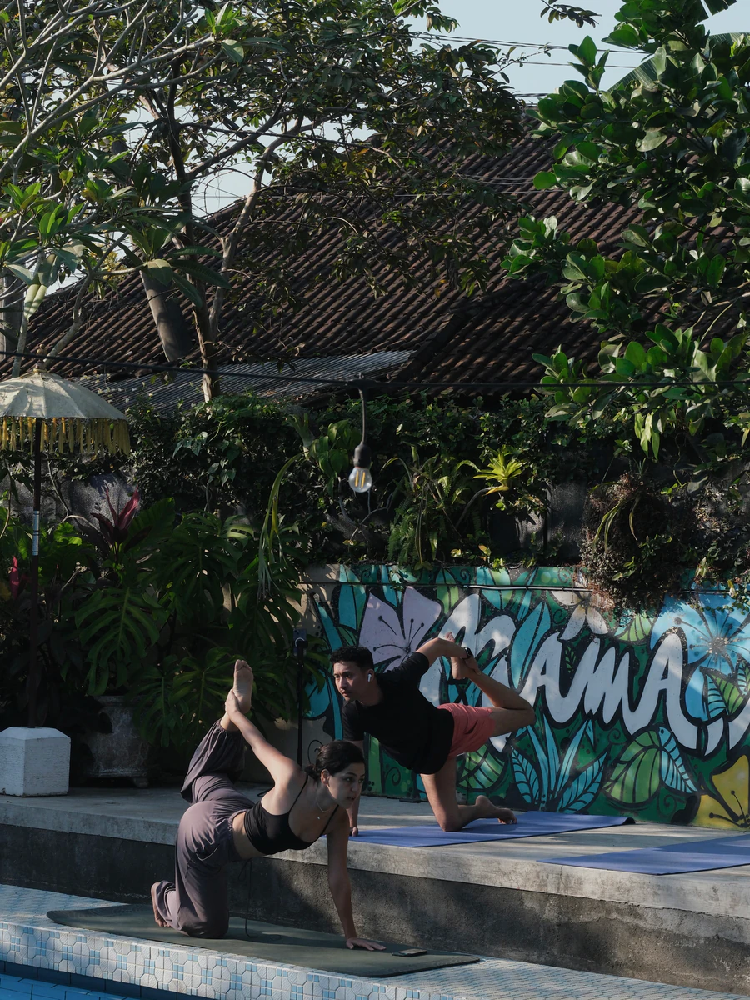
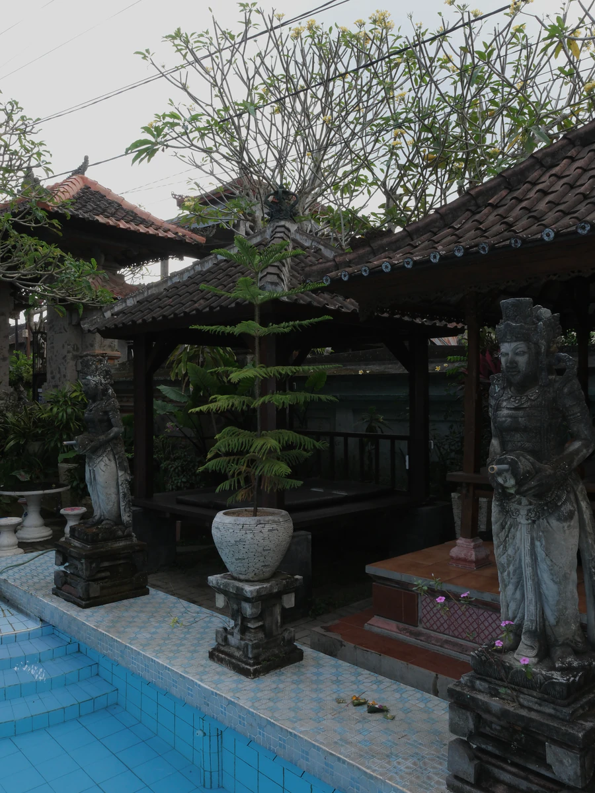
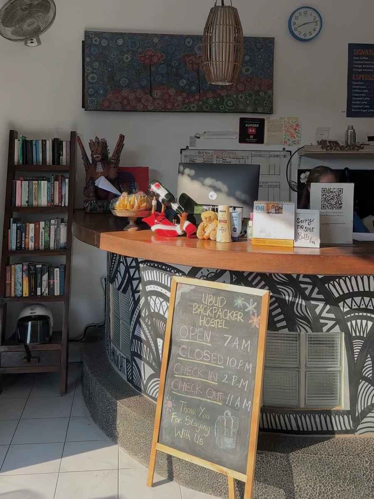

## Ubud Backpacker Hostel looks ordinary from the street, and surprisingly calm once you are inside.

It sits in Peliatan, close to central Ubud but off the main road. The first impression from outside is of a pretty standard budget hostel. Step through the courtyard, though, and the place opens up: a swimming pool, a shared kitchen, gazebos, and enough corners that you can disappear for a morning without leaving the property.

What stayed with us was how easy it was to choose the volume of the stay. You can talk to people. You can also sit by the pool with a book and not talk to anyone at all.

## First Impression

- Spacious
- Cozy
- Tropical
- Creative
- Relaxing

## Good For

- Budget Stay
- Social Stay
- Backpacker
- Solo Travel
- Pool
- Garden
- Workspace

# 2. THE EXPERIENCE

## You can be as social as you want

Staying here is more than having a bed for the night.

The dorm we used was spacious. The pool, kitchen, common room, gazebo, and garden give you somewhere to go at most hours, and the reception set the tone on the way in: check-in was quick, and the staff were one of the reasons the place felt easy.

Evenings tend to pull people into the common room. Mornings are slower. We saw guests swimming, sitting in the gazebo, and, on our morning, catching a yoga session by the pool. There is a billiard table if you want something to do without leaving.

### Ambience

**⭐ 4.6 / 5**

## Stay Experience

### Bed Comfort

**⭐ 4.6 / 5**

The beds were comfortable enough that sleep was not the thing we thought about. For a backpacker dorm, that is the point.

### Cleanliness

**⭐ 4.7 / 5**

The room and the shared areas stayed in good shape during our stay.

### Privacy

**⭐ 4.4 / 5**

It is still a dorm. You get a locker and a curtain of routine, not a private room. If you need real privacy, this is not the format.

### Check-in & Service

**⭐ 4.9 / 5**

This was one of the highlights. Arrival was straightforward, and the staff made the place feel looked after without hovering.

## Rooms & Space

### Area

**Indoor & Outdoor**

Spaces around the property include:

- Dorm rooms
- Swimming pool
- Shared kitchen
- Common room
- Gazebo
- Garden
- Workspace

### Space Size

**Spacious**

There is more ground to cover than the street front suggests. You are not stuck in the dorm if you want air, and you are not stuck in the common room if you want quiet.

## Environment

### Noise Level

**Social evenings · Quiet mornings**

Evenings are when the hostel feels most like a hostel. Mornings drop off, which is when the pool and gazebo are at their best.

### Air Conditioning

**AC**

Every room is air-conditioned. The pool, gazebo, and garden are open-air.

## Food & Kitchen

- Shared kitchen
- Drinking water

The kitchen is a proper shared setup, not a kettle in a corridor. We cooked and ate with other guests; that is part of how the place socialises you, whether you planned on it or not.

## Experience Scores

### Stay Experience

**⭐ 4.8 / 5**

### Service

**⭐ 4.6 / 5**

### Comfort

**⭐ 4.6 / 5**

# 3. GOOD TO KNOW

## Spending

**Under Rp500K per night**

For Ubud, that is the point of this stay. You are not paying for a boutique room. You are paying for a bed, the pool, and the people around you.

## Parking

### Motorcycle

**Enough**

### Car

**Limited**

A motorbike is easy to place. Arriving by car is tighter, and we would not count on a space being waiting.

## Facilities

- Wi-Fi
- Power Outlet
- Locker
- Swimming Pool
- Shared Kitchen
- Workspace
- Garden
- Changing Room
- Drinking Water

## Best Time to Visit

**Evening · Morning**

Evenings are for other people: the common room, a meal at the long table, sometimes a barbecue. Mornings are for the pool, the gazebo, and not talking if you do not want to.

## Reservation

**Not confirmed**

We did not check whether you need to book ahead. For a hostel this social, we would not turn up in high season without one.

## Accessibility

We did not confirm accessibility details during our visit.

# 4. UNIQUENESS

## The community is the point

What separates this from a cheap room near Ubud is not the pool. It is that the hostel actually runs as a community.

There are regular activities and events, so the evenings have a shape to them instead of everyone disappearing into their bunks. You can still sit out of it. You just have to choose to.

Mornings go the other way. Swim, take the gazebo, read, or, if you time it right, join a yoga session by the mural. There is a billiard table in the common room, so there is quite a lot to do without putting shoes back on.

## What's Unique Here

**A stay that socialises you**

You can come for a bed and leave having spoken to people you would not have met otherwise. That is either the reason to book, or the reason to book somewhere else.

## What Surprised Us

**How much we ended up talking**

We did not expect a budget hostel in Peliatan to push us into conversations quite this much. With a lot of international guests around, you get more English practice than you bargained for, and you hear about places and habits you would not run into in a private villa.

## Unique Features

- Community Events
- Swimming Pool
- Shared Kitchen
- Gazebo
- Billiards
- Garden

# 5. OUR TAKE

What we did not see coming was how much this place **pushes you to interact**.

That turned out to be the interesting part. Guests were friendly without being exhausting. You can still have a quiet hour by the pool, in the gazebo, or in the room. The difference is that a conversation is usually available if you want one.

A small, practical reminder from a dorm: turn your alarm off once you are up. You are sharing the room.

## But...

This is still a hostel.

If you want a door that closes on the rest of the building, a stay with almost no small talk, or a place that works for a family, this is the wrong format. The social layer is not optional décor. It is how the property is run.

## Who Might Skip This?

- Anyone who wants complete privacy
- Anyone who would rather not talk to strangers
- Families

# 6. THE VERDICT

## Is it worth your time?

If you are tired of the usual Ubud stay — a quiet room, a scooter, not much contact — this is worth considering. You might leave with more than a stamp in a ledger: a few conversations, a slower morning by the pool, and a slightly different picture of who else is here.

It is a good fit if you are open to meeting people and you want the hostel version of Ubud, not the villa version.

Skip it if you need privacy, or if a social common room at night sounds like work.

### Experience

**⭐ 4.8 / 5**

### Ambience

**⭐ 4.6 / 5**

### Visual

**⭐ 4.5 / 5**

### Service

**⭐ 4.6 / 5**

### Value for Money

**⭐ 4.6 / 5**

## Would We Come Back?

**Yes**

Especially for a few social nights, a cheaper base close to Ubud, or a stay where meeting people is part of the point.
